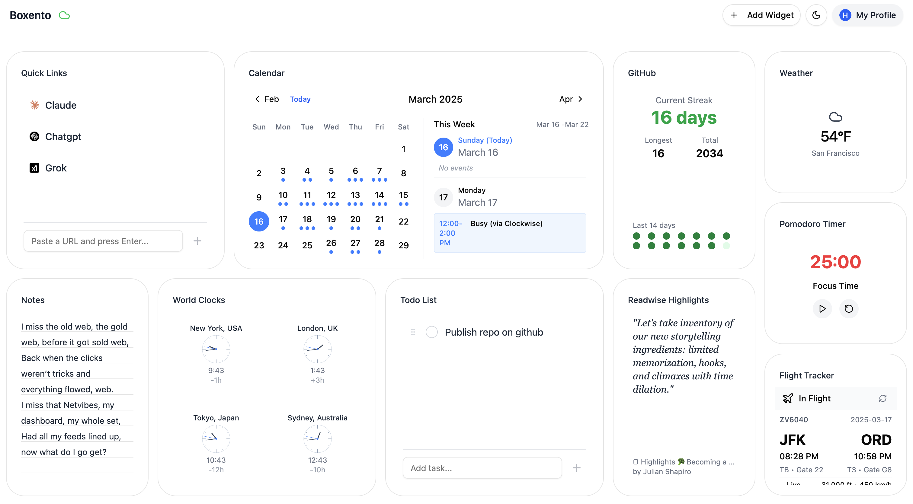
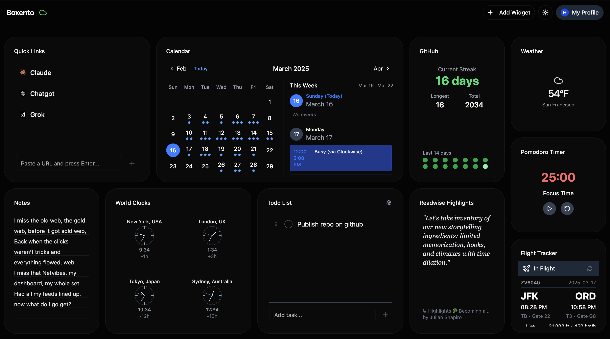

# Boxento



**Project Status:** Beta - Ready for early adopters and contributors! Expect some rough edges, but core functionality is solid.

## 🌟 Bringing Back the Magic of Start Pages

**Remember the golden days of My Yahoo and iGoogle?** Boxento is bringing that back - but better, open source, and completely in your control.

- **Seasoned developers** can dive deep into our codebase
- **Hobby coders** can modify existing widgets to suit their needs
- **Complete beginners** can use LLMs like ChatGPT, Claude, or LLM based code editors like Cursor or Windsurf to help generate widget code

There are no gatekeepers here - just bring your imagination, and we'll help you make it real. Check out our [Widget Development Guide](/docs/WIDGET_DEVELOPMENT.md) and [Template Widget](/src/components/widgets/TemplateWidget) to get started.

## 📋 Table of Contents
- [Why Boxento?](#-why-boxento)
- [What is Boxento?](#-what-is-boxento)
- [Installation](#-installation)
  - [Quick Start](#quick-start)
  - [Docker Installation](#docker-installation)
  - [Development Setup](#development-setup)
- [Making Boxento Your Own](#-making-boxento-your-own)
- [Progressive Web App Support](#-progressive-web-app-support)
- [For Developers and Tinkerers](#-for-developers-and-tinkerers)
- [Community & Support](#-community--support)
- [Roadmap](#️-roadmap)
- [License](#-license)

## 🔍 Why Boxento?

While big tech has abandoned customizable start pages, we believe in:

- **Your dashboard, your rules**: Unlike closed platforms, you own and control everything
- **Open source freedom**: Modify, extend, or completely transform it to suit your needs
- **Self-hosted privacy**: Your data stays on your systems
- **Creative expression**: Build your perfect internet starting point, exactly how you want it

## ✨ What is Boxento?

Boxento transforms your new tab or home page into a personalized command center with widgets that matter to you:

- ☑️ Track your to-dos and stay productive
- 🌤️ Check the weather without leaving your start page
- 🔗 Organize your favorite websites in one place
- 📝 Keep notes and ideas at your fingertips
- 🧩 Add more widgets or create your own!

All in a modern interface that gives you that warm, familiar feeling of the web's golden era.

## 🚀 Installation

### Quick Start

#### Option 1: Use the Online Demo
Visit our [live demo](https://boxento.app) to try Boxento instantly.

#### Option 2: Local Installation
**Prerequisites:**
- Bun (v1.0+)
- Git

```bash
git clone https://github.com/sushaantu/boxento.git
cd boxento
bun install
bun run dev
```

Visit [http://localhost:5173](http://localhost:5173) to see your personal dashboard.

### Docker Installation

We provide multiple ways to run Boxento using Docker, suitable for both development and production environments.

#### Prerequisites
- Docker
- Docker Compose (optional)

#### Quick Start with Pre-built Image
```bash
# Pull and run
docker run -d -p 5173:5173 --name boxento ghcr.io/sushaantu/boxento:latest
```

Need to use a custom domain? Add the VITE_ALLOWED_HOSTS environment variable:
```bash
docker run -d -p 5173:5173 -e VITE_ALLOWED_HOSTS=your-domain.com --name boxento ghcr.io/sushaantu/boxento:latest
```

#### Using Docker Compose
```yaml
# docker-compose.yml
services:
  boxento:
    image: ghcr.io/sushaantu/boxento:latest
    container_name: boxento
    restart: unless-stopped
    ports:
      - "5173:5173"
    environment:
      - NODE_ENV=production
      - VITE_ALLOWED_HOSTS=your-domain.com
```

```bash
docker compose up -d
```

### Operating Modes

Boxento supports two operating modes:

#### 🏠 Local-Only Mode (Default)
- **No authentication required** - Start using immediately
- **All data stored locally** in your browser's localStorage
- **No external dependencies** - Works completely offline
- **Privacy focused** - Your data never leaves your device

When running in local-only mode, you'll see "Local Mode" in the top-right corner instead of a login button.

#### ☁️ Cloud Sync Mode (Optional)
- **Firebase authentication** - Secure login with Google, GitHub, email/password
- **Cross-device sync** - Access your dashboard from multiple devices
- **Data backup** - Your settings are stored in Firestore
- **Requires setup** - Need to configure Firebase environment variables

To enable cloud sync mode, set up Firebase environment variables:
```bash
VITE_FIREBASE_API_KEY=your-api-key
VITE_FIREBASE_AUTH_DOMAIN=your-project.firebaseapp.com
VITE_FIREBASE_PROJECT_ID=your-project-id
# ... other Firebase config
```

**Note**: If you see "Firebase: Error (auth/api-key-not-valid)" - either run in local-only mode by removing all Firebase env vars, or set up valid Firebase credentials.

### Development Setup

#### Local Development with Docker
```bash
# Clone and setup
git clone https://github.com/sushaantu/boxento.git
cd boxento

# Start development container
docker compose up -d

# Stop when done
docker compose down
```

#### Production Deployment
```bash
# Setup environment
cp .env.example .env
# Edit .env with your configuration

# Build and start production
docker compose -f docker-compose.prod.yml up -d
```

#### Domain Configuration
The application automatically allows:
- localhost and 127.0.0.1
- *.docker.internal (Docker Desktop)
- *.orb.local (OrbStack)
- Custom domains via VITE_ALLOWED_HOSTS

To add custom domains:
```bash
VITE_ALLOWED_HOSTS=your-domain.com,another-domain.com docker compose up -d
```

## 📖 Making Boxento Your Own

### Widget Gallery

Boxento comes with a diverse collection of widgets organized by the same
categories you see in **Add Widget**:

#### Productivity

- **Calendar**: Display upcoming events and appointments
- **Quick Links**: Save and quickly access favorite links
- **Notes**: Take and save quick notes
- **Todo List**: Manage tasks and to-dos
- **Pomodoro Timer**: Time management with the Pomodoro Technique
- **GitHub Streak**: Track GitHub contribution streaks and activity
- **Todoist Tasks**: View and manage Todoist tasks
- **Habit Tracker**: Track daily habits and build streaks
- **Countdown**: Count down to important events and dates

#### Information

- **Weather**: Display current weather and forecast
- **World Clocks**: Display time across different time zones
- **Readwise Highlights**: Display highlights from Readwise
- **RSS Feed**: Display feeds from favorite websites
- **Year Progress**: Visualize progress through the year
- **Reader**: Surface articles from Readwise Reader

#### Finance

- **Currency Converter**: Convert currencies using live exchange rates
- **UF (Chile)**: Display UF value in CLP

#### Travel

- **Flight Tracker**: Monitor real-time flight status

#### Education

- **Geography Quiz**: Test your knowledge

#### Entertainment

- **YouTube Video**: Watch YouTube videos directly on your dashboard

#### Utilities

- **Embed**: Embed external content via iframe URL
- **QR Code**: Generate QR codes from text or URLs

#### Local Services

- **Services**: Monitor and access self-hosted services
- **Ollama Chat**: Chat with local Ollama AI models
- **Paisa Finance**: View net worth and asset breakdown from Paisa
- **Jellyfin**: View now playing and recently added media from Jellyfin
- **Fava**: View Beancount balance sheet and income statement
- **Riven**: Quick access to Riven media automation
- **System Health**: Monitor cron jobs and launchd services

#### Self-hosted

- **Uptime Kuma**: Display service monitors from an Uptime Kuma status feed
- **Healthchecks**: Display cron and dead-man-switch checks from Healthchecks

#### Home

- **Home Overview**: See lights, climate, security, and device health at a glance
- **Room Control**: Control devices for one Home Assistant room or area
- **Lights**: Toggle and review Home Assistant lights with realtime status
- **Climate**: Monitor thermostats, fans, humidity, and temperature sensors
- **Device Health**: Track unavailable devices, low batteries, and updates

### Customization

1. **Add Widgets**: Click "+" to add widgets
2. **Arrange**: Drag and drop anywhere
3. **Resize**: Grab corners to resize
4. **Configure**: Customize through settings

### Create Your Own Widgets

Anyone can create widgets - no matter your experience level:

1. Check our resources:
   - [Widget Development Guide](/docs/widget-development.md)
   - [Template Widget](/src/components/widgets/TemplateWidget)
2. Fork the repo
3. Use our guides with your favorite tools
4. Share with the community or keep for personal use

## 💻 For Developers and Tinkerers

### Tech Stack
- React
- Vite
- Tailwind CSS
- shadcn/ui

### Contributing
1. Fork and clone the repo
2. Create/update widgets in `/src/components/widgets/`
3. Test locally with `bun run dev`
4. Submit a PR

### Reporting Issues
Found a bug or have a feature request? Open an issue on our [GitHub repository](https://github.com/sushaantu/boxento/issues).

## 📱 Progressive Web App Support

Boxento includes PWA support for:
- **Install on device**: Add to home screen
- **Offline access**: Use without internet
- **Fast loading**: Enhanced performance

See our [PWA Support Guide](/docs/PWA_SUPPORT.md) for details.

## 📚 Community & Support

Join our community:
- [Discord Community](https://discord.gg/4NXFScs5rv)
- [GitHub Discussions](https://github.com/sushaantu/boxento/discussions)

## 🗺️ Roadmap

### Coming Soon (Q2 2025)
- 🔒 **End-to-End Encryption**: Complete data privacy
- 🌐 **Widget Marketplace**: Community-created widgets
- 📱 **Mobile Responsive Design**: Perfect on any device

Want to influence what we build next? Join our [Discord](https://discord.gg/4NXFScs5rv) or open a [feature request](https://github.com/sushaantu/boxento/issues).

## 📄 License

Boxento is open source under the MIT License - free to use, modify, and share.


